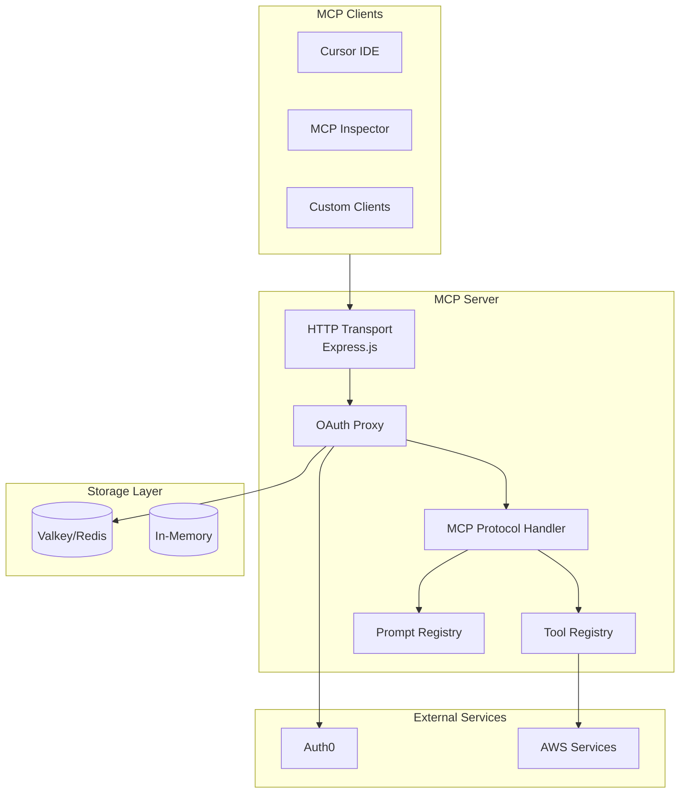
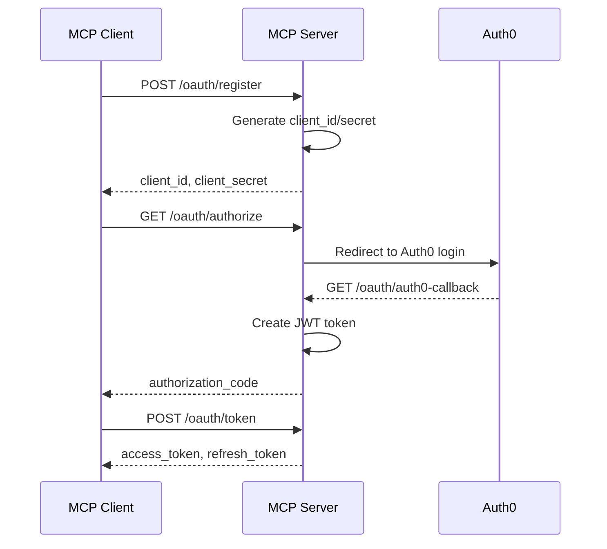
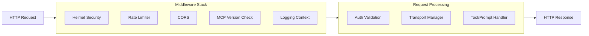
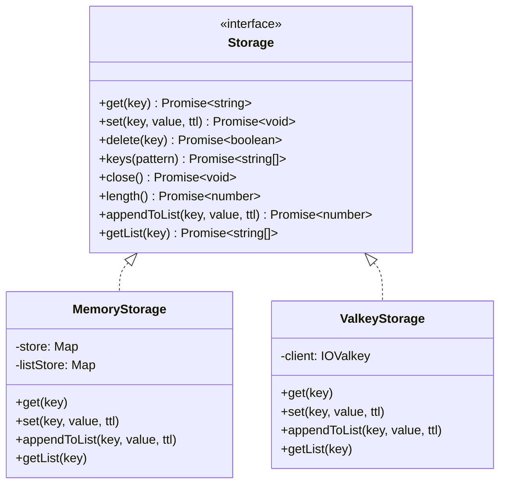
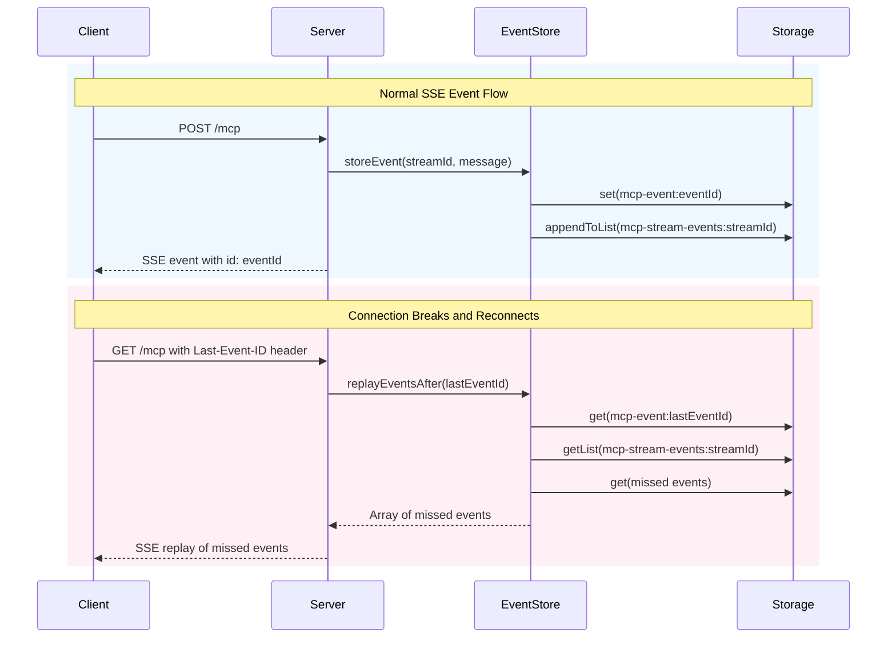
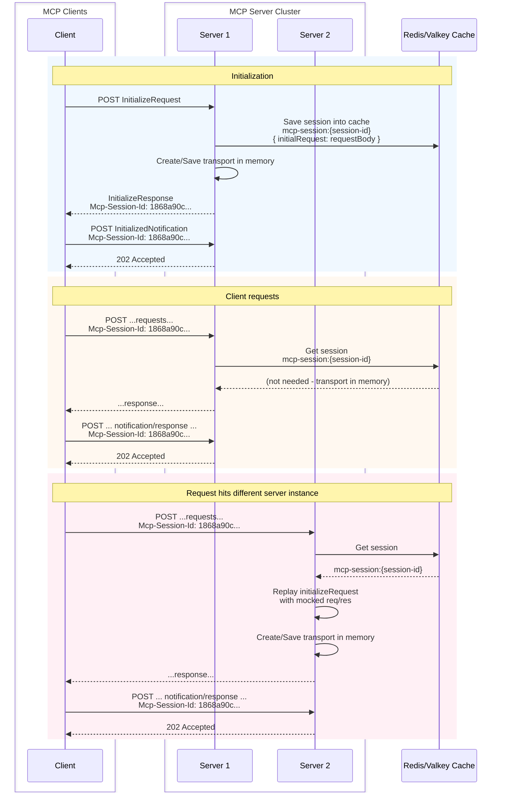

# Architecture Overview

This document provides an overview of the MCP Server Playground architecture, including system components, data flows, and key design decisions.

## Table of Contents

- [High-Level System Architecture](#high-level-system-architecture)
- [OAuth Authorization Flow](#oauth-authorization-flow)
- [Request Processing Flow](#request-processing-flow)
- [Storage Abstraction](#storage-abstraction)
- [SSE Resumability](#sse-resumability)
- [Stateful Session Management](#stateful-session-management)

---

## High-Level System Architecture

The MCP Server Playground follows a layered architecture with clear separation of concerns:

### Components

| Component                | Description                                                                |
| ------------------------ | -------------------------------------------------------------------------- |
| **HTTP Transport**       | Express.js server handling HTTP requests with streaming support            |
| **OAuth Proxy**          | Implements OAuth 2.0 with Dynamic Client Registration, delegating to Auth0 |
| **MCP Protocol Handler** | Processes MCP protocol messages and routes to tools/prompts                |
| **Tool Registry**        | Manages registered MCP tools with streaming execution support              |
| **Prompt Registry**      | Manages registered MCP prompts                                             |
| **Storage Layer**        | Pluggable storage for sessions, tokens, and OAuth data                     |

---

## OAuth Authorization Flow

The server implements an OAuth proxy pattern to enable Dynamic Client Registration while delegating actual authentication to Auth0:

### OAuth Endpoints

| Endpoint                                  | Method | Description                      |
| ----------------------------------------- | ------ | -------------------------------- |
| `/.well-known/oauth-authorization-server` | GET    | OAuth server metadata discovery  |
| `/.well-known/oauth-protected-resource`   | GET    | Protected resource metadata      |
| `/oauth/register`                         | POST   | Dynamic client registration      |
| `/oauth/authorize`                        | GET    | Authorization request initiation |
| `/oauth/token`                            | POST   | Token exchange                   |
| `/oauth/revoke`                           | POST   | Token revocation                 |
| `/oauth/auth0-callback`                   | GET    | Auth0 callback handler           |

---

## Request Processing Flow

All incoming HTTP requests pass through a middleware stack before reaching the MCP protocol handler:

### Middleware Components

| Middleware            | Purpose                                                                                           |
| --------------------- | ------------------------------------------------------------------------------------------------- |
| **Helmet**            | Security headers (CSP, XSS protection, etc.)                                                      |
| **Rate Limiter**      | 100 requests per minute per IP                                                                    |
| **CORS/Origin**       | Cross-origin request handling with strict Origin validation on MCP endpoints to prevent DNS rebinding attacks |
| **MCP Version Check** | Protocol version validation (2025-06-18, 2025-03-26)                                              |
| **Logging Context**   | Request correlation and structured logging                                                        |

---

## Storage Abstraction

The storage layer uses a pluggable interface pattern, allowing deployment with either in-memory storage (development) or Valkey/Redis (production):

### Storage Configuration

| Environment Variable             | Default  | Description                           |
| -------------------------------- | -------- | ------------------------------------- |
| `MCP_CONFIG_STORAGE_TYPE`        | `memory` | Storage backend: `memory` or `valkey` |
| `MCP_CONFIG_STORAGE_VALKEY_URL`  | -        | Valkey/Redis connection URL           |
| `MCP_CONFIG_STORAGE_SESSION_TTL` | `3600`   | Session TTL in seconds                |

---

## SSE Resumability

The server implements SSE resumability per [MCP 2025-06-18 specification](https://modelcontextprotocol.io/specification/2025-06-18/basic/transports#resumability-and-redelivery), allowing clients to reconnect and resume receiving events using the `Last-Event-ID` header. This is powered by the `MCPEventStore` component.

### EventStore Storage Keys

| Key Pattern                       | Description                                    |
| --------------------------------- | ---------------------------------------------- |
| `mcp-event:{eventId}`             | Individual event data stored as JSON           |
| `mcp-stream-events:{streamId}`    | Ordered list of event IDs for a specific stream |

### How It Works

1. **Event Storage**: When the server sends an SSE event, it stores the event data and appends the event ID to the stream's index list using atomic operations.

2. **Client Reconnection**: When a client reconnects with a `Last-Event-ID` header, the server looks up which stream the event belongs to.

3. **Event Replay**: The server retrieves all event IDs from the stream index that come after the last received event and replays them to the client.

4. **TTL Management**: Events expire automatically based on the configured session TTL (default: 1 hour) to prevent unbounded storage growth.

---

## Stateful Session Management

When deploying the MCP server as a cluster, sessions must be shared across instances. The server uses a session replay mechanism to maintain state:

### How Session Replay Works

1. **Initial Request**: When a client first connects, Server 1 saves the `InitializeRequest` body to the cache along with the session ID.

2. **Same Server**: If subsequent requests hit the same server, the transport is already in memory - no cache lookup needed.

3. **Different Server**: If a request hits Server 2 (which doesn't have the transport in memory):
   - Server 2 retrieves the session data from the cache
   - It replays the original `InitializeRequest` with mocked request/response objects
   - This recreates the transport in Server 2's memory
   - The actual request is then processed normally

This approach enables horizontal scaling while maintaining MCP's stateful session semantics.

### Design References

- Inspired by [MCP GitHub Discussion #102](https://github.com/modelcontextprotocol/modelcontextprotocol/discussions/102)
- Follows the [MCP Specification 2025-06-18](https://modelcontextprotocol.io/specification/2025-06-18/) session management guidelines
