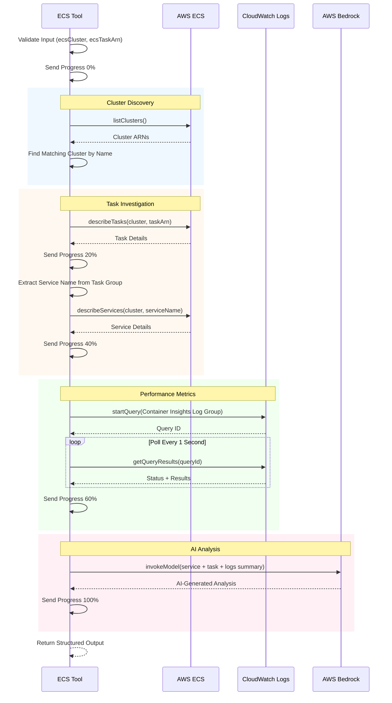

# AWS ECS Tool

Investigate ECS services, tasks, and CloudWatch logs with AI-powered analysis using Amazon Bedrock. This tool provides comprehensive ECS task troubleshooting by combining service metrics, task details, performance logs, and AI-generated analysis.

## Prerequisites

- AWS credentials with access to ECS, CloudWatch Logs, and Bedrock
- Container Insights enabled on the ECS cluster
- Bedrock model access (Claude by default)

## Process Flow



## Input Schema

| Parameter    | Type   | Required | Default | Description                                         |
| ------------ | ------ | -------- | ------- | --------------------------------------------------- |
| `ecsCluster` | string | Yes      | -       | Name of the ECS cluster (e.g., `my-cluster-123456`) |
| `ecsTaskArn` | string | Yes      | -       | Full ARN of the ECS task to investigate             |

### Task ARN Format

```
arn:aws:ecs:{region}:{account-id}:task/{cluster-name}/{task-id}
```

Example: `arn:aws:ecs:us-east-1:123456789012:task/my-cluster/abc123def456`

## Output Schema

| Field            | Type   | Description                                                        |
| ---------------- | ------ | ------------------------------------------------------------------ |
| `analysis`       | string | AI-generated analysis from Bedrock with recommendations            |
| `service`        | object | Service metrics (desiredCount, runningCount, pendingCount, events) |
| `task`           | object | Task details (cpu, memory, healthStatus, containers, tags)         |
| `cloudwatchLogs` | array  | Recent performance metrics from Container Insights                 |

### Service Object

| Field          | Type   | Description                   |
| -------------- | ------ | ----------------------------- |
| `desiredCount` | number | Target number of tasks        |
| `runningCount` | number | Currently running tasks       |
| `pendingCount` | number | Tasks in pending state        |
| `events`       | array  | Recent service events (max 5) |

### Task Object

| Field          | Type   | Description                             |
| -------------- | ------ | --------------------------------------- |
| `group`        | string | Task group (e.g., `service:my-service`) |
| `cpu`          | string | CPU units allocated                     |
| `memory`       | string | Memory allocated (MB)                   |
| `healthStatus` | string | Health check status                     |
| `lastStatus`   | string | Current task status                     |
| `startedAt`    | string | Task start timestamp                    |
| `containers`   | array  | Container statuses                      |
| `tags`         | array  | Task tags                               |

### CloudWatch Logs Entry

| Field                      | Type   | Description                   |
| -------------------------- | ------ | ----------------------------- |
| `logAt`                    | string | Log timestamp                 |
| `cpuReserved`              | number | Reserved CPU units            |
| `cpuUtilized`              | number | Utilized CPU units            |
| `cpuUtilizedPercentage`    | number | CPU utilization percentage    |
| `memoryReserved`           | number | Reserved memory (MB)          |
| `memoryUtilized`           | number | Utilized memory (MB)          |
| `memoryUtilizedPercentage` | number | Memory utilization percentage |

## Examples

**Example: Investigate an ECS task**

```json
{
  "input": {
    "ecsCluster": "production-cluster",
    "ecsTaskArn": "arn:aws:ecs:us-east-1:123456789012:task/production-cluster/abc123def456"
  },
  "output": {
    "analysis": "The ECS task is running normally with CPU utilization at 45% and memory at 67%. No concerning events in the last 5 service events. The service has reached a steady state with 3/3 tasks running.\n\n[View ECS Service](https://us-east-1.console.aws.amazon.com/ecs/v2/clusters/production-cluster/services/my-service/health?region=us-east-1)",
    "service": {
      "desiredCount": 3,
      "runningCount": 3,
      "pendingCount": 0,
      "events": [
        {
          "createdAt": "2026-01-27 10:00:00",
          "message": "service production-service has reached a steady state."
        }
      ]
    },
    "task": {
      "group": "service:my-service",
      "cpu": "256",
      "memory": "512",
      "healthStatus": "HEALTHY",
      "lastStatus": "RUNNING",
      "startedAt": "2026-01-27 08:00:00",
      "containers": [
        {
          "name": "app",
          "lastStatus": "RUNNING"
        }
      ]
    },
    "cloudwatchLogs": [
      {
        "logAt": "2026-01-27 10:30:00",
        "cpuReserved": 256,
        "cpuUtilized": 115.2,
        "cpuUtilizedPercentage": 45.0,
        "memoryReserved": 512,
        "memoryUtilized": 343.04,
        "memoryUtilizedPercentage": 67.0
      }
    ]
  }
}
```

## Configuration

| Environment Variable                                 | Default                                     | Description                   |
| ---------------------------------------------------- | ------------------------------------------- | ----------------------------- |
| `MCP_CONFIG_TOOLS_AWS_REGION`                        | `us-east-1`                                 | AWS region for ECS/CloudWatch |
| `MCP_CONFIG_TOOLS_AWS_PROFILE`                       | `default`                                   | AWS profile name              |
| `MCP_CONFIG_TOOLS_AWS_CREDENTIALS_ACCESS_KEY_ID`     | -                                           | AWS access key (optional)     |
| `MCP_CONFIG_TOOLS_AWS_CREDENTIALS_SECRET_ACCESS_KEY` | -                                           | AWS secret key (optional)     |
| `MCP_CONFIG_TOOLS_AWS_CREDENTIALS_SESSION_TOKEN`     | -                                           | AWS session token (optional)  |
| `MCP_CONFIG_TOOLS_AWS_BEDROCK_REGION`                | `us-east-1`                                 | Bedrock region                |
| `MCP_CONFIG_TOOLS_AWS_BEDROCK_PROFILE`               | `default`                                   | Bedrock AWS profile           |
| `MCP_CONFIG_TOOLS_AWS_BEDROCK_MODEL`                 | `anthropic.claude-3-5-sonnet-20241022-v2:0` | Bedrock model ID              |

## Error Handling

| Error                 | Cause                                     | Resolution                                                  |
| --------------------- | ----------------------------------------- | ----------------------------------------------------------- |
| `Cluster not found`   | Cluster name doesn't match any ARN        | Verify the cluster exists in the configured region          |
| `Access Denied`       | Insufficient IAM permissions              | Ensure credentials have ECS, CloudWatch, and Bedrock access |
| `Model not available` | Bedrock model access not enabled          | Enable the model in AWS Bedrock console                     |
| `Task not found`      | Invalid task ARN or task no longer exists | Verify the task ARN is correct and task is still running    |

## Required IAM Permissions

```json
{
  "Version": "2012-10-17",
  "Statement": [
    {
      "Effect": "Allow",
      "Action": [
        "ecs:ListClusters",
        "ecs:DescribeTasks",
        "ecs:DescribeServices"
      ],
      "Resource": "*"
    },
    {
      "Effect": "Allow",
      "Action": ["logs:StartQuery", "logs:GetQueryResults"],
      "Resource": "arn:aws:logs:*:*:log-group:/aws/ecs/containerinsights/*"
    },
    {
      "Effect": "Allow",
      "Action": ["bedrock:InvokeModel"],
      "Resource": "arn:aws:bedrock:*::foundation-model/*"
    }
  ]
}
```

## Tags

`aws`, `ecs`, `task`, `service`, `cloudwatch`, `bedrock`
