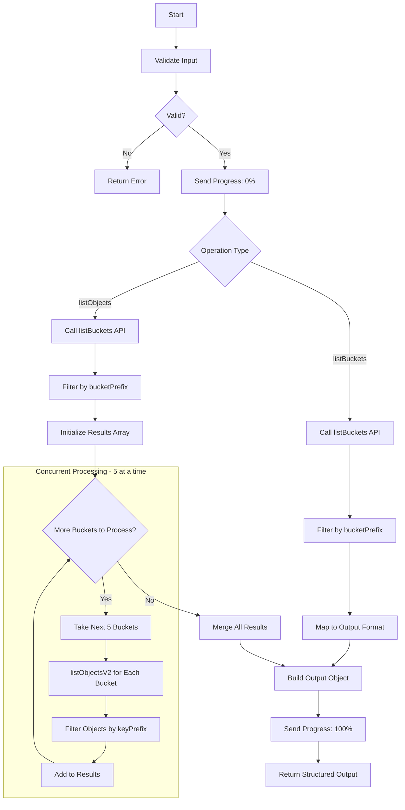
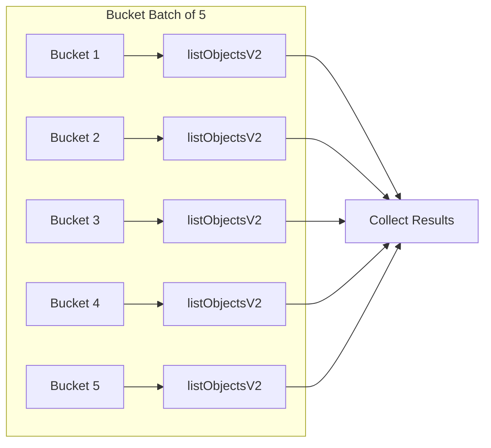

# AWS S3 Tool

List S3 buckets and objects with optional prefix filtering. This tool provides two operations: listing buckets only, or listing buckets along with their objects.

## Prerequisites

- AWS credentials with S3 read access (`s3:ListAllMyBuckets`, `s3:ListBucket`)

## Process Flow



### Object Listing Concurrency



## Input Schema

| Parameter      | Type   | Required | Default | Description                                           |
| -------------- | ------ | -------- | ------- | ----------------------------------------------------- |
| `operation`    | enum   | Yes      | -       | Operation type: `listBuckets` or `listObjects`        |
| `bucketPrefix` | string | No       | `""`    | Filter buckets by name prefix                         |
| `keyPrefix`    | string | No       | `""`    | Filter objects by key prefix (only for `listObjects`) |

### Operations

| Operation     | Description                                                      |
| ------------- | ---------------------------------------------------------------- |
| `listBuckets` | List all S3 buckets matching the bucket prefix filter            |
| `listObjects` | List buckets AND their objects (with optional key prefix filter) |

## Output Schema

| Field                    | Type   | Description                               |
| ------------------------ | ------ | ----------------------------------------- |
| `buckets`                | array  | Array of bucket objects                   |
| `buckets[].name`         | string | Bucket name                               |
| `buckets[].creationDate` | string | Bucket creation date (ISO format)         |
| `buckets[].objects`      | array  | Array of objects (only for `listObjects`) |

### Object Structure (for `listObjects` operation)

| Field          | Type   | Description                  |
| -------------- | ------ | ---------------------------- |
| `key`          | string | Object key (path)            |
| `lastModified` | string | Last modification timestamp  |
| `size`         | number | Object size in bytes         |
| `storageClass` | string | S3 storage class             |
| `owner`        | object | Owner information (optional) |

## Examples

**Example 1: List all buckets**

```json
{
  "input": {
    "operation": "listBuckets"
  },
  "output": {
    "buckets": [
      {
        "name": "my-app-assets",
        "creationDate": "2025-06-15T10:30:00.000Z",
        "objects": []
      },
      {
        "name": "my-app-logs",
        "creationDate": "2025-06-15T10:31:00.000Z",
        "objects": []
      },
      {
        "name": "other-project-data",
        "creationDate": "2025-07-20T08:15:00.000Z",
        "objects": []
      }
    ]
  }
}
```

**Example 2: List buckets with prefix filter**

```json
{
  "input": {
    "operation": "listBuckets",
    "bucketPrefix": "my-app"
  },
  "output": {
    "buckets": [
      {
        "name": "my-app-assets",
        "creationDate": "2025-06-15T10:30:00.000Z",
        "objects": []
      },
      {
        "name": "my-app-logs",
        "creationDate": "2025-06-15T10:31:00.000Z",
        "objects": []
      }
    ]
  }
}
```

**Example 3: List objects with key prefix filter**

```json
{
  "input": {
    "operation": "listObjects",
    "bucketPrefix": "my-app-logs",
    "keyPrefix": "2026/01/"
  },
  "output": {
    "buckets": [
      {
        "name": "my-app-logs",
        "creationDate": "2025-06-15T10:31:00.000Z",
        "objects": [
          {
            "key": "2026/01/27/app.log",
            "lastModified": "2026-01-27T10:00:00.000Z",
            "size": 1048576,
            "storageClass": "STANDARD",
            "owner": {
              "displayName": "aws-account",
              "id": "abc123..."
            }
          },
          {
            "key": "2026/01/27/error.log",
            "lastModified": "2026-01-27T10:05:00.000Z",
            "size": 2048,
            "storageClass": "STANDARD"
          }
        ]
      }
    ]
  }
}
```

## Configuration

| Environment Variable                                 | Default     | Description                  |
| ---------------------------------------------------- | ----------- | ---------------------------- |
| `MCP_CONFIG_TOOLS_AWS_REGION`                        | `us-east-1` | AWS region                   |
| `MCP_CONFIG_TOOLS_AWS_PROFILE`                       | `default`   | AWS profile name             |
| `MCP_CONFIG_TOOLS_AWS_CREDENTIALS_ACCESS_KEY_ID`     | -           | AWS access key (optional)    |
| `MCP_CONFIG_TOOLS_AWS_CREDENTIALS_SECRET_ACCESS_KEY` | -           | AWS secret key (optional)    |
| `MCP_CONFIG_TOOLS_AWS_CREDENTIALS_SESSION_TOKEN`     | -           | AWS session token (optional) |

## Error Handling

| Error            | Cause                               | Resolution                                                                |
| ---------------- | ----------------------------------- | ------------------------------------------------------------------------- |
| `Access Denied`  | Insufficient S3 permissions         | Ensure credentials have `s3:ListAllMyBuckets` and `s3:ListBucket` permissions |
| `NoSuchBucket`   | Bucket doesn't exist or was deleted | Verify bucket name and that it exists in the account                      |
| `Invalid region` | Bucket is in a different region     | Objects are listed using the bucket's region automatically                |

## Required IAM Permissions

```json
{
  "Version": "2012-10-17",
  "Statement": [
    {
      "Effect": "Allow",
      "Action": ["s3:ListAllMyBuckets", "s3:GetBucketLocation"],
      "Resource": "*"
    },
    {
      "Effect": "Allow",
      "Action": ["s3:ListBucket"],
      "Resource": "arn:aws:s3:::*"
    }
  ]
}
```

## Performance Considerations

- Buckets are processed in batches of 5 to avoid API rate limiting
- Large buckets with many objects may take time to list
- Use `keyPrefix` to limit results for large buckets
- Consider using more specific `bucketPrefix` to reduce the number of buckets scanned

## Tags

`aws`, `s3`, `storage`
