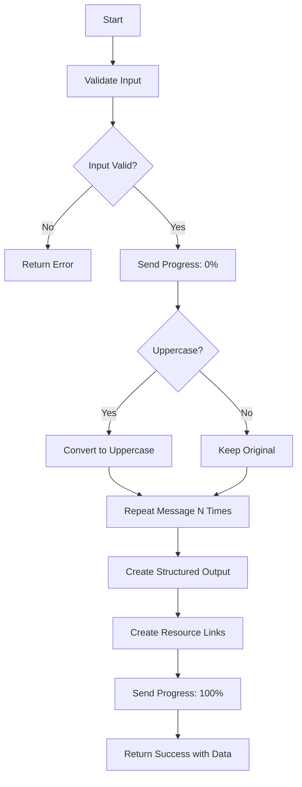

# Echo Tool

Echo a message back with optional transformations, repetition, and structured output support. This is a utility tool useful for testing MCP connectivity and demonstrating tool patterns.

## Process Flow



## Input Schema

| Parameter   | Type    | Required | Default | Description                                  |
| ----------- | ------- | -------- | ------- | -------------------------------------------- |
| `message`   | string  | Yes      | -       | The message to echo back (1-1000 characters) |
| `repeat`    | integer | No       | `1`     | Number of times to repeat the message (1-10) |
| `uppercase` | boolean | No       | `false` | Whether to convert the message to uppercase  |

## Output Schema

| Field              | Type    | Description                                  |
| ------------------ | ------- | -------------------------------------------- |
| `originalMessage`  | string  | The original input message                   |
| `processedMessage` | string  | The processed output message                 |
| `repeat`           | number  | Number of repetitions applied                |
| `uppercase`        | boolean | Whether uppercase transformation was applied |
| `length`           | number  | Length of the final processed message        |

## Examples

**Example 1: Simple echo**

```json
{
  "input": {
    "message": "Hello, World!"
  },
  "output": {
    "originalMessage": "Hello, World!",
    "processedMessage": "Hello, World!",
    "repeat": 1,
    "uppercase": false,
    "length": 13
  }
}
```

**Example 2: Echo with repetition and uppercase**

```json
{
  "input": {
    "message": "Hello",
    "repeat": 3,
    "uppercase": true
  },
  "output": {
    "originalMessage": "Hello",
    "processedMessage": "HELLO HELLO HELLO",
    "repeat": 3,
    "uppercase": true,
    "length": 17
  }
}
```

## Error Handling

| Error                  | Cause                              | Resolution                                |
| ---------------------- | ---------------------------------- | ----------------------------------------- |
| `Message is required`  | Empty or missing message parameter | Provide a non-empty message string        |
| `Message too long`     | Message exceeds 1000 characters    | Reduce message length to under 1000 chars |
| `Invalid repeat value` | Repeat value outside 1-10 range    | Use a repeat value between 1 and 10       |

## Tags

`utility`, `example`, `text`
