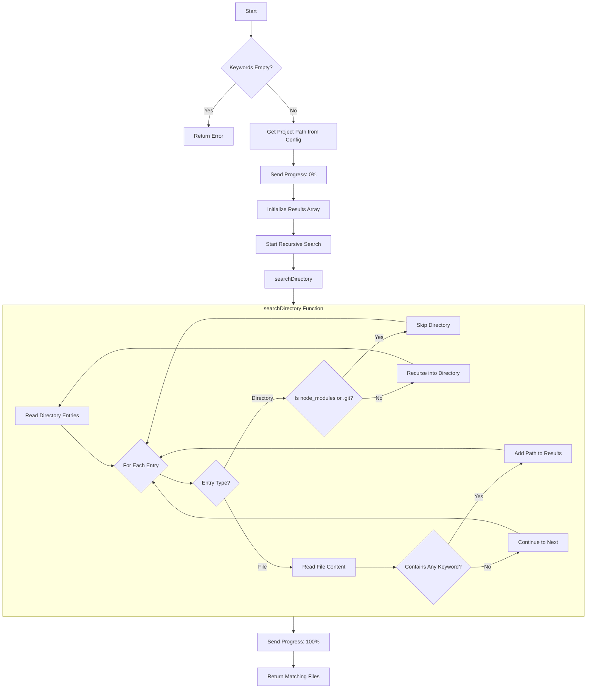
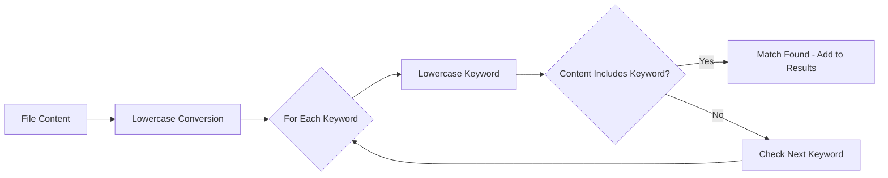

# Project Tool

Search for keywords across files in the configured project directory. This tool recursively scans files and returns paths that contain any of the specified keywords.

## Process Flow



### Keyword Matching



## Input Schema

| Parameter  | Type     | Required | Default | Description                     |
| ---------- | -------- | -------- | ------- | ------------------------------- |
| `keywords` | string[] | Yes      | -       | Array of keywords to search for |

### Search Behavior

- **Case-insensitive**: Keywords are matched regardless of case
- **Partial matching**: Keywords can match anywhere within file content
- **OR logic**: Files matching ANY keyword are included in results
- **Excluded directories**: `node_modules` and `.git` are automatically skipped

## Output Schema

| Field   | Type     | Description                               |
| ------- | -------- | ----------------------------------------- |
| `files` | string[] | Array of absolute file paths with matches |

## Examples

**Example 1: Search for authentication-related files**

```json
{
  "input": {
    "keywords": ["auth", "login", "jwt"]
  },
  "output": {
    "files": [
      "/project/src/core/server/auth/handlers.ts",
      "/project/src/core/server/auth/services/jwtService.ts",
      "/project/src/core/server/auth/services/oauthService.ts",
      "/project/src/config/type.ts"
    ]
  }
}
```

**Example 2: Search for specific patterns**

```json
{
  "input": {
    "keywords": ["TODO", "FIXME"]
  },
  "output": {
    "files": [
      "/project/src/tools/project/index.ts",
      "/project/src/tools/streaming/index.ts"
    ]
  }
}
```

**Example 3: Search for configuration usage**

```json
{
  "input": {
    "keywords": ["MCP_CONFIG"]
  },
  "output": {
    "files": ["/project/.env.example", "/project/src/config/manager.ts"]
  }
}
```

## Configuration

| Environment Variable            | Default | Description                         |
| ------------------------------- | ------- | ----------------------------------- |
| `MCP_CONFIG_TOOLS_PROJECT_PATH` | `/tmp`  | Root directory for project searches |

## Error Handling

| Error                   | Cause                         | Resolution                                    |
| ----------------------- | ----------------------------- | --------------------------------------------- |
| `Keywords are required` | Empty keywords array provided | Provide at least one keyword to search for    |
| `Failed to read file`   | Permission or encoding issue  | Check file permissions and encoding           |
| `Directory not found`   | Project path doesn't exist    | Verify `MCP_CONFIG_TOOLS_PROJECT_PATH` is set |

## Performance Considerations

- Large directories may take time to scan
- Binary files that can't be read as UTF-8 are skipped with a warning
- The tool uses sequential directory traversal for memory efficiency

## Tags

`project`, `utility`, `core`, `search`
