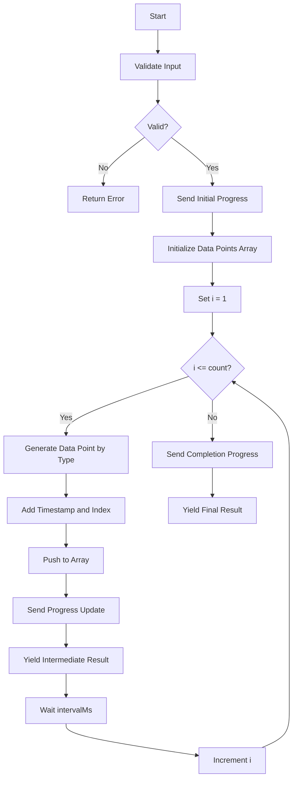
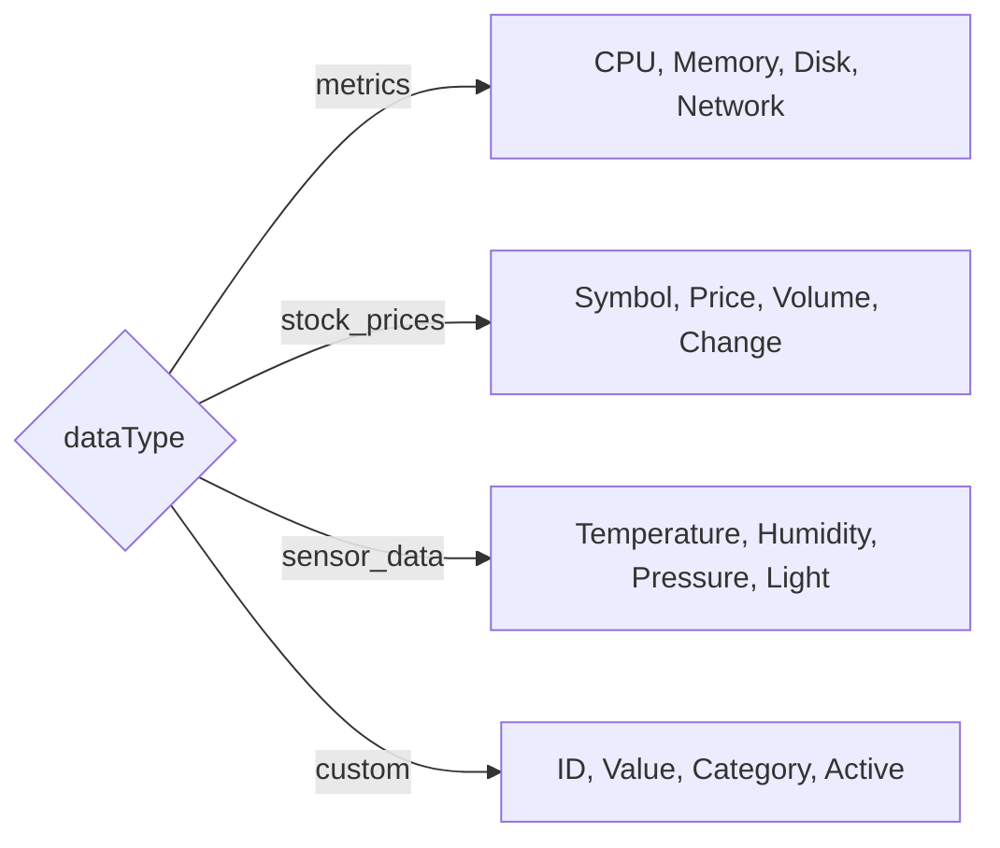

# Streaming Tool

Simulate real-time streaming data with live updates. This tool demonstrates MCP's streaming capabilities by generating data points at configurable intervals.

> **Note**: Streaming output may return the final result instead of intermediate updates depending on the MCP client implementation.

## Process Flow



### Data Generation by Type



## Input Schema

| Parameter    | Type    | Required | Default   | Description                                                                |
| ------------ | ------- | -------- | --------- | -------------------------------------------------------------------------- |
| `dataType`   | enum    | No       | `metrics` | Type of data to stream: `metrics`, `stock_prices`, `sensor_data`, `custom` |
| `count`      | integer | No       | `5`       | Number of data points to generate (1-50)                                   |
| `intervalMs` | integer | No       | `1000`    | Interval between data points in milliseconds (100-5000)                    |

### Data Types

| Type           | Description                 | Generated Fields                               |
| -------------- | --------------------------- | ---------------------------------------------- |
| `metrics`      | System performance metrics  | `cpu`, `memory`, `disk`, `network`             |
| `stock_prices` | Simulated stock market data | `symbol`, `price`, `volume`, `change`          |
| `sensor_data`  | IoT sensor readings         | `temperature`, `humidity`, `pressure`, `light` |
| `custom`       | Generic custom data         | `id`, `value`, `category`, `active`            |

## Output Schema

| Field           | Type   | Description                             |
| --------------- | ------ | --------------------------------------- |
| `dataType`      | string | The type of data that was streamed      |
| `count`         | number | Total number of data points requested   |
| `intervalMs`    | number | Interval between points in milliseconds |
| `totalDuration` | number | Total execution time in milliseconds    |
| `dataPoints`    | array  | Array of timestamped data point objects |
| `completedAt`   | string | ISO timestamp when streaming completed  |

### Data Point Structure

Each data point in the `dataPoints` array has:

| Field       | Type   | Description                          |
| ----------- | ------ | ------------------------------------ |
| `timestamp` | string | ISO timestamp when point was created |
| `index`     | number | 1-based index of the data point      |
| `value`     | object | Type-specific data (see Data Types)  |

## Examples

**Example 1: Stream system metrics**

```json
{
  "input": {
    "dataType": "metrics",
    "count": 5,
    "intervalMs": 1000
  },
  "output": {
    "dataType": "metrics",
    "count": 5,
    "intervalMs": 1000,
    "totalDuration": 5000,
    "dataPoints": [
      {
        "timestamp": "2026-01-27T10:30:00.000Z",
        "index": 1,
        "value": {
          "cpu": 45.23,
          "memory": 67.89,
          "disk": 35.12,
          "network": 234.56
        }
      },
      {
        "timestamp": "2026-01-27T10:30:01.000Z",
        "index": 2,
        "value": {
          "cpu": 52.1,
          "memory": 68.45,
          "disk": 35.15,
          "network": 189.32
        }
      }
    ],
    "completedAt": "2026-01-27T10:30:05.000Z"
  }
}
```

**Example 2: Stream stock prices**

```json
{
  "input": {
    "dataType": "stock_prices",
    "count": 3,
    "intervalMs": 2000
  },
  "output": {
    "dataType": "stock_prices",
    "count": 3,
    "intervalMs": 2000,
    "totalDuration": 6000,
    "dataPoints": [
      {
        "timestamp": "2026-01-27T10:30:00.000Z",
        "index": 1,
        "value": {
          "symbol": "DEMO",
          "price": 125.45,
          "volume": 5678,
          "change": 2.3
        }
      }
    ],
    "completedAt": "2026-01-27T10:30:06.000Z"
  }
}
```

## Metadata

Each response includes metadata with streaming state:

| Field              | Type    | Description                                   |
| ------------------ | ------- | --------------------------------------------- |
| `streamingEnabled` | boolean | Always `true` for this tool                   |
| `isIntermediate`   | boolean | `true` for partial results, `false` for final |
| `currentPoint`     | number  | Current data point index (intermediate)       |
| `totalPoints`      | number  | Total expected data points                    |
| `completed`        | boolean | `true` when streaming is complete             |

## Error Handling

| Error                | Cause                              | Resolution                         |
| -------------------- | ---------------------------------- | ---------------------------------- |
| `Invalid count`      | Count outside 1-50 range           | Use a count between 1 and 50       |
| `Invalid intervalMs` | Interval outside 100-5000 range    | Use an interval between 100-5000ms |
| `Streaming failed`   | Unexpected error during generation | Check server logs for details      |

## Tags

`streaming`, `real-time`, `data`
