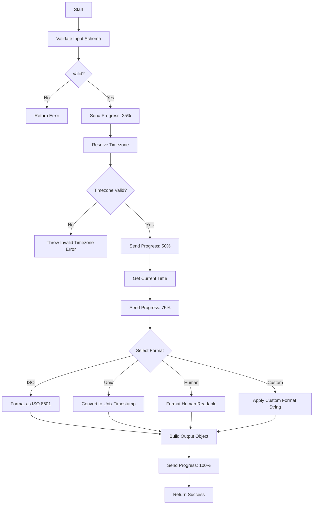

# System Time Tool

Get the current system time in various formats with timezone support. This utility tool provides flexible timestamp formatting for different use cases.

## Process Flow



## Input Schema

| Parameter         | Type    | Required | Default        | Description                                               |
| ----------------- | ------- | -------- | -------------- | --------------------------------------------------------- |
| `format`          | enum    | No       | `iso`          | Output format: `iso`, `unix`, `human`, `custom`           |
| `timezone`        | string  | No       | Server default | IANA timezone (e.g., `America/New_York`, `Europe/London`) |
| `customFormat`    | string  | No       | -              | Custom format string (required when format is `custom`)   |
| `includeTimezone` | boolean | No       | `true`         | Whether to include timezone in human-readable output      |

### Custom Format Tokens

When using `format: "custom"`, the following tokens are supported:

| Token  | Description          | Example |
| ------ | -------------------- | ------- |
| `YYYY` | 4-digit year         | `2026`  |
| `YY`   | 2-digit year         | `26`    |
| `MM`   | 2-digit month        | `01`    |
| `M`    | Month (no padding)   | `1`     |
| `DD`   | 2-digit day          | `27`    |
| `D`    | Day (no padding)     | `27`    |
| `HH`   | 2-digit hour (24h)   | `14`    |
| `H`    | Hour (no padding)    | `14`    |
| `mm`   | 2-digit minutes      | `05`    |
| `m`    | Minutes (no padding) | `5`     |
| `ss`   | 2-digit seconds      | `09`    |
| `s`    | Seconds (no padding) | `9`     |
| `SSS`  | 3-digit milliseconds | `123`   |

## Output Schema

| Field       | Type             | Description                                   |
| ----------- | ---------------- | --------------------------------------------- |
| `timestamp` | string \| number | Formatted timestamp based on requested format |
| `timezone`  | string           | The resolved timezone used                    |
| `format`    | string           | The format that was applied                   |
| `utc`       | string           | UTC timestamp in ISO 8601 format              |
| `unix`      | number           | Unix timestamp (seconds since epoch)          |
| `human`     | string           | Human-readable formatted string               |

## Examples

**Example 1: Default ISO format**

```json
{
  "input": {},
  "output": {
    "timestamp": "2026-01-27T10:30:00.000Z",
    "timezone": "UTC",
    "format": "iso",
    "utc": "2026-01-27T10:30:00.000Z",
    "unix": 1769494200,
    "human": "Monday, January 27, 2026 at 10:30:00 AM Coordinated Universal Time"
  }
}
```

**Example 2: Unix timestamp**

```json
{
  "input": {
    "format": "unix"
  },
  "output": {
    "timestamp": 1769494200,
    "timezone": "UTC",
    "format": "unix",
    "utc": "2026-01-27T10:30:00.000Z",
    "unix": 1769494200,
    "human": "Monday, January 27, 2026 at 10:30:00 AM Coordinated Universal Time"
  }
}
```

**Example 3: Custom format with timezone**

```json
{
  "input": {
    "format": "custom",
    "customFormat": "YYYY-MM-DD HH:mm:ss",
    "timezone": "America/New_York"
  },
  "output": {
    "timestamp": "2026-01-27 05:30:00",
    "timezone": "America/New_York",
    "format": "custom",
    "utc": "2026-01-27T10:30:00.000Z",
    "unix": 1769494200,
    "human": "Monday, January 27, 2026 at 5:30:00 AM Eastern Standard Time"
  }
}
```

## Configuration

| Environment Variable   | Description                     |
| ---------------------- | ------------------------------- |
| `MCP_CONFIG_TIME_ZONE` | Default timezone for the server |

## Error Handling

| Error                              | Cause                                           | Resolution                       |
| ---------------------------------- | ----------------------------------------------- | -------------------------------- |
| `Invalid timezone: {tz}`           | Unrecognized IANA timezone identifier           | Use a valid IANA timezone string |
| `Custom format string is required` | Format is `custom` but no customFormat provided | Provide a customFormat string    |

## Tags

`system`, `time`, `utility`, `core`
